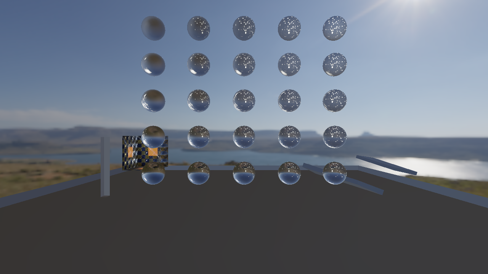

# LumaBough · 光枝

一个 Windows / C++20 渲染工程作品集：用 D3D11 与 D3D12 实现同一套
RenderPacket、Render Graph 和资源生命周期，记录性能优化的收益与适用边界。

展示名称为 **LumaBough**；内部 namespace、CMake targets 和程序名保留 MiniEngine。
这是从私有开发工程筛选出的独立源码库，未导入私人历史。

截图是本仓库构建的固定场景输出；[采集身份与验证范围](docs/evidence/BATCH-B.md)。
Release 的 `v0.1.0-preview` 提供**运行 ZIP、双后端演示视频与去标识性能证据包**，
它们是本仓库源码在指定提交上构建并通过核验的产物，见 [候选裁定](docs/evidence/CANDIDATE-REVIEW.md)。

## 从这里开始

| 了解什么 | 入口 |
|---|---|
| 模块、帧流程与线程所有权 | [架构与三张图](docs/architecture/README.md) |
| 哪些结论有证据，哪些仍待补齐 | [声明与证据入口](docs/evidence/README.md) |
| 如何构建、运行和测试 | [开发指南](docs/DEVELOPMENT.md) |

## 当前范围

源码包含 D3D11 / D3D12 后端、图编译与瞬态资源复用、离线资产烘焙、
确定性 packet 构建、任务调度和 revision 资产加载契约。
这些是源码导览；公开能力结论仍以 [Claim Ledger](docs/evidence/CLAIM-LEDGER.csv) 为准。
历史原工程的 PASS 不自动迁移为本仓库的运行或发布结论。

只支持 Windows x64。Vulkan 未实施。设备丢失会报告失败，不承诺自动恢复；
资产导入支持有边界的 glTF 子集，不是完整编辑器或通用商业引擎。
并行 packet 的历史收益只适用于 packet 成本占比较高的场景；
“池内存恒定”不等于“进程无泄漏”，见 [历史结论与勘正](docs/evidence/HISTORICAL-CLAIMS.md)。

## 源码构建与运行

前置：Visual Studio 2026 C++ / MSVC v145、Windows SDK（含 DXC）、CMake 4.2+、Python。
首次配置会下载固定版本依赖。命令从仓库根执行：

~~~powershell
. ./tools/dev/Enter-MiniEngineDevShell.ps1
cmake --preset windows-msvc-debug
cmake --build --preset windows-msvc-debug --config Release --parallel 6
ctest --preset windows-msvc-debug -C Release --output-on-failure
out/build/windows-msvc-debug/samples/rhi_sandbox/Release/MiniEngineSandbox.exe --rhi=d3d12 --smoke-level=6 --frames=9
~~~

上面的 smoke 不需要烘焙场景。PBR 场景、双后端运行、测试分类及环境排错见
[开发指南](docs/DEVELOPMENT.md)。

若不想构建：下载 Release `v0.1.0-preview` 里的运行 ZIP，解压后按包内 `RUN.md` 两条命令即可双后端运行，
不需要 Visual Studio、SDK、DXC 或 Python；下载后请先按 `SHA256SUMS-external.txt` 校验哈希。
**已验证范围**：Windows 10/11 x64、D3D11 与 D3D12、场景 `m4-visual-baseline`，第二台机器独立运行通过；
**未做**真实读者走查，`m7-*` 性能场景与 GPU Capture 工具链不在包内。见
[支持矩阵与候选裁定](docs/evidence/CANDIDATE-REVIEW.md)。

## 许可与贡献

项目自有代码采用 [MIT](LICENSE)。第三方代码、模型和纹理保留各自的
[许可与署名](THIRD-PARTY-NOTICES.md)；请勿把测试资产中的第三方标志用于项目品牌。
修改前阅读 [仓库指南](AGENTS.md)。可见渲染改动提供复现参数与画面，工具改动跑相应契约测试；
未授权的资产、构建输出、原始 capture 和私人机器配置不进入源码清单。

[文档目录](docs/README.md) · [路线图](docs/ROADMAP.md) · [变更记录](docs/CHANGELOG.md)

本地 [连续 Demo](docs/portfolio/DEMO.md) 已完成双后端三轮彩排；[历史性能重算](docs/portfolio/PERFORMANCE.md)保留正反结果与源码身份限制。
