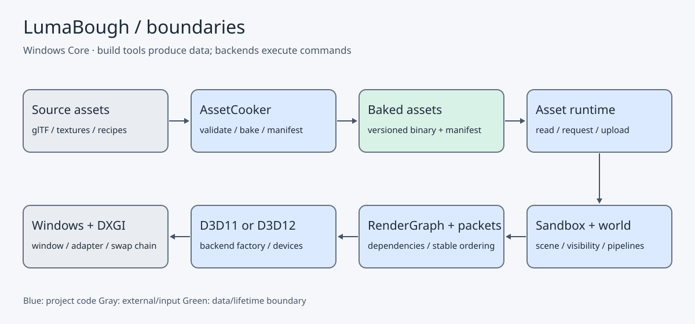
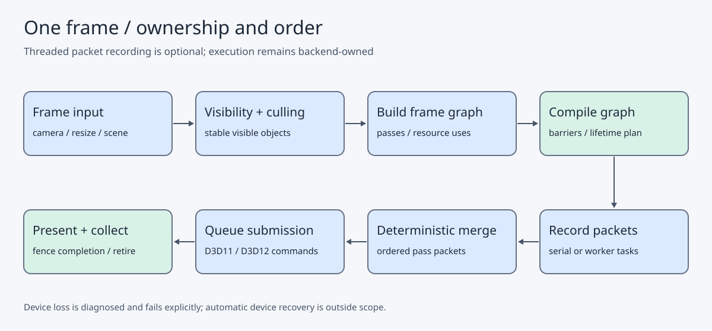
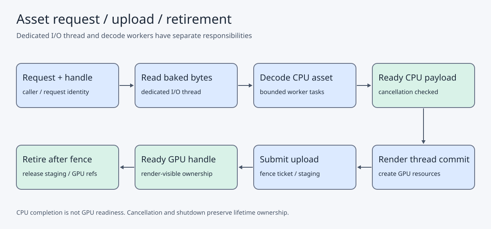

# 架构：边界、帧与生命周期

范围为当前 Core 源码。下图是代码审阅后的静态说明；
核对身份和实际 boundary/composition 结果见 [批次 B](../evidence/BATCH-B.md)。
图源为 [JSON](diagrams.json)，由 [生成脚本](../../tools/dev/render_architecture.py) 导出 SVG；
导出图内嵌图源 SHA-256。项目实现使用蓝色，操作系统/第三方工具用灰色，数据与同步点用绿色。
箭头说明数据流或执行顺序，不代表所有节点直接链接。

## 上下文与模块

源 glTF/纹理由 AssetCooker 离线烘焙；运行时读取受约束的烘焙格式，
不把 fastgltf/stb 解析链引入运行时。World 提取 RenderPacket，
Renderer 声明 pass，Render Graph 编译顺序和访问，RHI adapter 实现 D3D11/D3D12 的具体操作。

[Core](../../engine/core/CMakeLists.txt) 不依赖 World/Assets/Render；
[Tasks](../../engine/tasks/CMakeLists.txt) 是纯 CPU 调度，不直接调用 RHI。
[Render Graph](../../engine/render_graph/CMakeLists.txt) 只链接 public RHI。
[Factory](../../engine/rhi/CMakeLists.txt) 在组合根选择后端；
native API 类型留后端，不能穿透到共享图与 packet。

系统窗口和输入由 Windows platform 承担；PIX/RenderDoc/Tracy 是外部观察工具。
fastgltf、stb、MikkTSpace、GoogleTest 等是第三方依赖，见 [许可清单](../../THIRD-PARTY-NOTICES.md)。

## 一帧与同步

[运行器](../../samples/rhi_sandbox/M6SceneRunner.cpp)与
[M7 运行器](../../samples/rhi_sandbox/M7SceneRunner.cpp)负责帧级编排。
worker 只读冻结快照，构建 packet；主线程在使用结果前等待对应 task group。
并行结果按稳定键合并，不能让 worker 完成顺序改变提交语义。

[渲染管线](../../engine/render/src/M6RenderPipeline.cpp)声明资源访问，
图编译处理依赖、裁剪和资源生命周期；执行器转换访问并调用 RHI。
CPU 提交与 GPU 完成不是同一时刻；帧资源和退休对象必须等待完成信号。
零尺寸窗口走跳过路径，恢复后重建相关资源。设备丢失是显式失败，当前不承诺自动恢复。

## 异步资产与所有权

[AsyncAssetLoader](../../engine/assets/async/src/AsyncAssetLoader.cpp)管理专用 I/O 线程；
decode 任务使用 CPU worker，而不是把磁盘读取阻塞在计算 worker 上。
[上传协调器](../../engine/assets/async/src/AssetUploadCoordinator.cpp)在帧点接受预算约束，
[sample 的 UploadSink](../../samples/rhi_sandbox/RhiUploadSink.cpp)负责具体 GPU 操作。

revision 匹配后才替换 Ready 资源；缺文件、解析失败或过期请求保留旧 Ready。
请求记录的生命周期与 GPU 资源的生命周期分开：终态记录可释放，
GPU 使用中的资源在 fence 完成后退休。容量上限是护栏，不能代替正常调用方释放。
队列背压、取消和 shutdown 必须有明确收尾；不把这个三段 CPU 流水线画成多 GPU queue 并行。

## 关键取舍

[三个公开决策](DECISIONS.md)解释双后端后提炼 RHI、资源生命周期以及确定性并行。
源码负责可执行事实；图不承诺完整 glTF、通用编辑器、无限规模或所有场景的性能收益。
